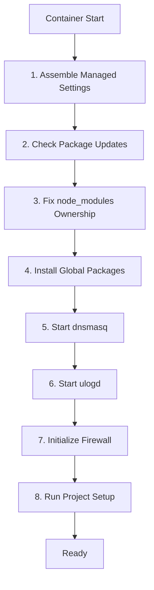

# Architecture Documentation

## Executive Summary

Claude DevContainer is a secure, AI-agent-ready development container providing a sandboxed environment for AI-assisted development with Claude Code and Gemini CLI.

**Key Architectural Decisions:**
1. **Security-first design**: Firewall with domain allowlist, security hooks
2. **Plugin architecture**: Modular Claude Code plugins for extensibility
3. **Multi-instance support**: Parallel development environments
4. **Monorepo structure**: Shared tooling, coordinated releases

---

## System Architecture

```
┌─────────────────────────────────────────────────────────────────────────┐
│                         Host Machine                                     │
│  ┌───────────────────────────────────────────────────────────────────┐  │
│  │                    Docker Container                                │  │
│  │  ┌─────────────────────────────────────────────────────────────┐  │  │
│  │  │                    Application Layer                         │  │  │
│  │  │  ┌─────────────┐  ┌─────────────┐  ┌──────────────────────┐ │  │  │
│  │  │  │ Claude Code │  │ Gemini CLI  │  │   User Application   │ │  │  │
│  │  │  └──────┬──────┘  └──────┬──────┘  └──────────────────────┘ │  │  │
│  │  │         │                │                                    │  │  │
│  │  │  ┌──────▼────────────────▼──────┐                            │  │  │
│  │  │  │     Security Hook Layer       │                            │  │  │
│  │  │  │  ┌─────────────────────────┐ │                            │  │  │
│  │  │  │  │ PreToolUse Hooks        │ │                            │  │  │
│  │  │  │  │ - prevent-main-push     │ │                            │  │  │
│  │  │  │  │ - prevent-env-leakage   │ │                            │  │  │
│  │  │  │  │ - prevent-sensitive-*   │ │                            │  │  │
│  │  │  │  └─────────────────────────┘ │                            │  │  │
│  │  │  └──────────────────────────────┘                            │  │  │
│  │  └─────────────────────────────────────────────────────────────┘  │  │
│  │                                                                    │  │
│  │  ┌─────────────────────────────────────────────────────────────┐  │  │
│  │  │                    Network Security Layer                    │  │  │
│  │  │  ┌────────────┐  ┌────────────┐  ┌────────────────────────┐ │  │  │
│  │  │  │   dnsmasq  │  │  iptables  │  │       ulogd            │ │  │  │
│  │  │  │ (DNS fwd)  │  │  + ipset   │  │ (firewall logging)     │ │  │  │
│  │  │  └────────────┘  └────────────┘  └────────────────────────┘ │  │  │
│  │  │                                                              │  │  │
│  │  │  ┌────────────────────────────────────────────────────────┐ │  │  │
│  │  │  │              Domain Allowlist                           │ │  │  │
│  │  │  │  /etc/allowed-domains.txt (base)                        │ │  │  │
│  │  │  │  .devcontainer/allowed-domains.txt (project)            │ │  │  │
│  │  │  └────────────────────────────────────────────────────────┘ │  │  │
│  │  └─────────────────────────────────────────────────────────────┘  │  │
│  │                                                                    │  │
│  │  ┌─────────────────────────────────────────────────────────────┐  │  │
│  │  │                    Runtime Layer                             │  │  │
│  │  │  ┌────────────┐  ┌────────────┐  ┌────────────────────────┐ │  │  │
│  │  │  │ Node.js 22 │  │ Python 3.x │  │    ZSH + tmux          │ │  │  │
│  │  │  │   + pnpm   │  │            │  │  + Powerlevel10k       │ │  │  │
│  │  │  └────────────┘  └────────────┘  └────────────────────────┘ │  │  │
│  │  └─────────────────────────────────────────────────────────────┘  │  │
│  └───────────────────────────────────────────────────────────────────┘  │
│                                                                          │
│  ┌────────────────────────────────────────────────────────────────────┐ │
│  │                      Volume Mounts                                  │ │
│  │  ┌───────────┐ ┌───────────┐ ┌───────────┐ ┌────────────────────┐  │ │
│  │  │ /workspace│ │~/.claude  │ │~/.gemini  │ │   node_modules     │  │ │
│  │  │  (bind)   │ │  (volume) │ │  (volume) │ │     (volume)       │  │ │
│  │  └───────────┘ └───────────┘ └───────────┘ └────────────────────┘  │ │
│  └────────────────────────────────────────────────────────────────────┘ │
└─────────────────────────────────────────────────────────────────────────┘
```

---

## Component Architecture

### 1. Docker Image (image/)

The container image is built on Node.js 22 and includes:

```
image/
├── Dockerfile           # Multi-stage build
├── config/              # Runtime configuration
├── hooks/               # Security hooks (shared)
└── scripts/             # Initialization scripts
```

**Initialization Sequence (post-create.sh):**



### 2. Security Hook System

Hooks intercept Claude Code and Gemini CLI tool calls:

```
┌──────────────┐     ┌───────────────┐     ┌──────────────┐
│  AI Tool     │────▶│  Hook Runner  │────▶│   Actual     │
│  Request     │     │               │     │   Execution  │
└──────────────┘     └───────┬───────┘     └──────────────┘
                             │
                    ┌────────▼────────┐
                    │   PreToolUse    │
                    │     Hooks       │
                    ├─────────────────┤
                    │ prevent-main-push│
                    │ prevent-no-verify│
                    │ prevent-env-leak │
                    │ prevent-admin    │
                    │ prevent-sensitive│
                    └─────────────────┘
                             │
                    Exit 0: ALLOW ───▶ Continue
                    Exit 2: BLOCK ───▶ Return Error
```

### 3. Firewall Architecture

Domain-based allowlist using iptables:

```
┌─────────────────────────────────────────────────────────────┐
│                     Outbound Traffic                         │
└───────────────────────────┬─────────────────────────────────┘
                            │
              ┌─────────────▼─────────────┐
              │      DNS Resolution       │
              │        (dnsmasq)          │
              └─────────────┬─────────────┘
                            │
              ┌─────────────▼─────────────┐
              │     IP Address Check      │
              │    (ipset allowed-ips)    │
              └─────────────┬─────────────┘
                            │
           ┌────────────────┼────────────────┐
           │                │                │
    ┌──────▼──────┐  ┌──────▼──────┐  ┌──────▼──────┐
    │   ACCEPT    │  │   NFLOG     │  │   REJECT    │
    │ (allowed)   │  │ (log block) │  │ (blocked)   │
    └─────────────┘  └─────────────┘  └─────────────┘
```

**Allowed by Default:**
- GitHub API (dynamically fetched)
- NPM Registry
- Anthropic API
- Google APIs (Gemini)
- GPG Keyservers

---

## Multi-Part Integration

### Part Relationships

```
┌─────────────────────────────────────────────────────────────────┐
│                         Docker Image                             │
│                           (image/)                               │
│  ┌─────────────────────────────────────────────────────────────┐│
│  │                    Built-in Components                       ││
│  │  ┌──────────────┐  ┌──────────────┐  ┌──────────────────┐   ││
│  │  │ Security     │  │ Network      │  │ Shell            │   ││
│  │  │ Hooks        │  │ Security     │  │ Environment      │   ││
│  │  └──────────────┘  └──────────────┘  └──────────────────┘   ││
│  └─────────────────────────────────────────────────────────────┘│
│                              │                                   │
│                    ┌─────────▼─────────┐                        │
│                    │   Embedded CLIs   │                        │
│  ┌─────────────────┼───────────────────┼─────────────────────┐  │
│  │                 │                   │                     │  │
│  │  ┌──────────────▼────┐   ┌─────────▼──────────────────┐  │  │
│  │  │ claude-instance   │   │      bmad-cli              │  │  │
│  │  │ /usr/local/bin/   │   │   /usr/local/bin/          │  │  │
│  │  └───────────────────┘   └────────────────────────────┘  │  │
│  └──────────────────────────────────────────────────────────┘  │
└─────────────────────────────────────────────────────────────────┘

┌─────────────────────────────────────────────────────────────────┐
│                    Claude Code Plugins                           │
│                      (packages/)                                 │
│  ┌─────────────────┐  ┌─────────────────┐  ┌─────────────────┐  │
│  │  git-workflow   │  │ claude-instance │  │bmad-orchestrator│  │
│  │                 │  │                 │  │                 │  │
│  │ ┌─────────────┐ │  │ ┌─────────────┐ │  │ ┌─────────────┐ │  │
│  │ │   Skills    │ │  │ │    Hooks    │ │  │ │    Hooks    │ │  │
│  │ │  Commands   │ │  │ │    CLI      │ │  │ │    CLI      │ │  │
│  │ │   Hooks     │ │  │ └─────────────┘ │  │ │   Docs      │ │  │
│  │ └─────────────┘ │  │                 │  │ └─────────────┘ │  │
│  └─────────────────┘  └─────────────────┘  └─────────────────┘  │
│           │                   │                   │              │
│           └───────────────────┼───────────────────┘              │
│                               ▼                                  │
│                    Claude Code Plugin System                     │
│                       (runtime loading)                          │
└─────────────────────────────────────────────────────────────────┘
```

### Integration Points

| From | To | Integration Type | Description |
|------|----|--------------------|-------------|
| image | claude-instance | Embedded Binary | Copied to /usr/local/bin during build |
| image | bmad-orchestrator | Embedded Binary | Symlinked to /usr/local/bin |
| image | git-workflow | Plugin Install | Available via npm install |
| claude-instance | Docker | API Calls | Container management |
| claude-instance | tmux | Process Control | Terminal session management |
| bmad-orchestrator | Claude Code | Subprocess | Spawns Claude for story execution |
| git-workflow | Claude Code | Plugin System | Skills and commands loaded at runtime |

### Data Flow

```
User Input
    │
    ▼
┌──────────────┐
│  Claude Code │
│   or Gemini  │
└──────┬───────┘
       │
       ▼
┌──────────────┐     ┌──────────────┐
│   Security   │────▶│   Tool       │
│    Hooks     │     │  Execution   │
└──────────────┘     └──────┬───────┘
                            │
              ┌─────────────┼─────────────┐
              │             │             │
       ┌──────▼──────┐ ┌────▼────┐ ┌──────▼──────┐
       │   Bash      │ │  File   │ │   Other     │
       │  Commands   │ │  Ops    │ │   Tools     │
       └──────┬──────┘ └─────────┘ └─────────────┘
              │
              ▼
┌──────────────────────────────────┐
│         Network Layer            │
│  (firewall domain allowlist)     │
└──────────────────────────────────┘
```

---

## Package Distribution

### Publishing Flow

```
┌─────────────────┐
│   Git Push to   │
│      main       │
└────────┬────────┘
         │
         ▼
┌─────────────────┐     ┌─────────────────┐
│  GitHub Actions │────▶│  Docker Buildx  │
│   Trigger       │     │  Multi-arch     │
└─────────────────┘     └────────┬────────┘
                                 │
                    ┌────────────┼────────────┐
                    │            │            │
             ┌──────▼──────┐ ┌───▼────┐ ┌─────▼─────┐
             │   linux/    │ │linux/  │ │   Tags    │
             │   amd64     │ │arm64   │ │           │
             └─────────────┘ └────────┘ └───────────┘
                    │            │            │
                    └────────────┼────────────┘
                                 │
                                 ▼
                    ┌─────────────────────────┐
                    │        ghcr.io/         │
                    │ zookanalytics/          │
                    │ claude-devcontainer     │
                    └─────────────────────────┘
```

### Consumer Usage

```
Consumer Project
       │
       ▼
┌─────────────────────────────────┐
│  .devcontainer/devcontainer.json │
│  image: ghcr.io/zookanalytics/  │
│         claude-devcontainer     │
└─────────────────────────────────┘
       │
       ▼
┌─────────────────────────────────┐
│     Container Initialization     │
│  1. Pull image                   │
│  2. Mount volumes                │
│  3. Run post-create.sh           │
│  4. Ready for development        │
└─────────────────────────────────┘
```

---

## Security Model

### Defense in Depth

```
┌─────────────────────────────────────────────────────────────────┐
│  Layer 1: Network Isolation                                      │
│  - Container network namespace                                   │
│  - Domain allowlist firewall                                     │
│  - DNS resolution logging                                        │
└─────────────────────────────────────────────────────────────────┘
                              │
┌─────────────────────────────▼───────────────────────────────────┐
│  Layer 2: Tool Interception                                      │
│  - PreToolUse hooks for all Bash/File operations                │
│  - Block sensitive env var access                                │
│  - Block access to credential files                              │
└─────────────────────────────────────────────────────────────────┘
                              │
┌─────────────────────────────▼───────────────────────────────────┐
│  Layer 3: Git Protection                                         │
│  - Block pushes to main/master                                   │
│  - Block --no-verify flag                                        │
│  - Block --admin bypass                                          │
└─────────────────────────────────────────────────────────────────┘
                              │
┌─────────────────────────────▼───────────────────────────────────┐
│  Layer 4: Least Privilege                                        │
│  - Non-root user (node)                                          │
│  - Sudo only for specific scripts                                │
│  - Minimal capabilities (NET_ADMIN, NET_RAW, SYSLOG)            │
└─────────────────────────────────────────────────────────────────┘
```

### Threat Mitigation

| Threat | Mitigation |
|--------|------------|
| Credential exfiltration | Env var hooks, file access hooks |
| Unauthorized network access | Domain allowlist firewall |
| Production branch corruption | Git push hooks |
| Bypass attempts | --no-verify, --admin hooks |
| Container escape | Standard Docker isolation |

---

## Extensibility Points

### For Image Consumers

1. **Domain Allowlist**: `.devcontainer/allowed-domains.txt`
2. **Project Setup**: `.devcontainer/post-create-project.sh`
3. **Claude Settings**: `.claude/settings.json`
4. **VS Code Config**: `.devcontainer/devcontainer.json`

### For Plugin Developers

1. **Skills**: Reusable instruction sets in `skills/*/SKILL.md`
2. **Commands**: Slash commands in `commands/*.md`
3. **Hooks**: Pre/Post tool hooks in `hooks/`

### For Container Developers

1. **Security Hooks**: Add to `image/hooks/`
2. **Scripts**: Add to `image/scripts/`
3. **Configuration**: Add to `image/config/`

---

*Generated: 2026-01-03*
*Scan Level: Exhaustive*
